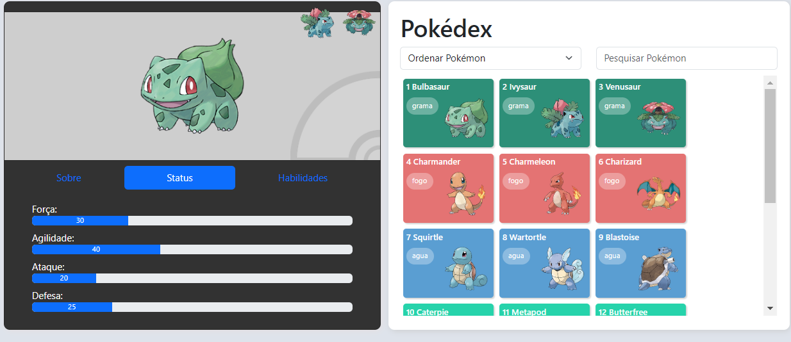

<h1 align="center"> Pokédex </h1>

<p align="center">
Este é um projeto desenvolvido no curso Desenvolvimento Web Avançado com Vue (v2 e v3) e Vuex, da Udemy.
</p>

<p align="center">
  
</p>

## 🚀 Tecnologias

Esse projeto foi desenvolvido utilizando:
- VueJS
- Vue Router
- Json Server

## 💻 Projeto
Pokédex é uma aplicação em que registra e fornecer informações sobre os diferentes tipos de Pokémon, inclui detalhes como o nome do Pokémon, imagem, tipos, habilidades, e uma breve descrição e suas evoluções. Permite ao usuário escolher e selecionar um Pokémon para saber mais detalhes e também adicionar mais habilidades.

## Project setup
```
npm install
```

### Start the development server
```
npm run start
```

### Start the development JSON server
```
npm server
```

### Compiles and minifies for production
```
npm run build
```

### Lints and fixes files
```
npm run lint
```

### Customize configuration
See [Configuration Reference](https://cli.vuejs.org/config/).
